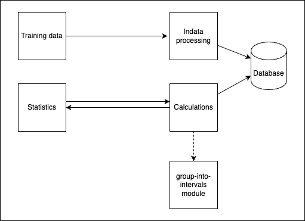

# Reflektioner över laboration 3
## Återanvänd kod
- Pipeline: Jag återanvände _ci.yml_ filen som jag hade skapat i 1DV613 eftersom jag tycker det är smidigt att skapa en Docker-fil av koden och köra applikationen i en container i stället för att kopiera alla enstaka filer till min server. Det innebär dock ett beroende till Dockerhub, vilket skapade problem när deras service låg nere och jag därför inte kunde driftsätta mina ändringar.   Jag tog hjälp av ett LLM för att ta reda på hur pipelinen kan spara testrapporten som skapas när de automatiska enhetstesterna körs.  
- Frontend: Jag återanvände lite av koden som jag hade gjort i L2 när jag testade vad man kunde göra med outputen av min modul. Men efterhand ändrade jag den ganska mycket, både när det gäller funktionalitet och kodkvalitet.

## Kvarstående issues
- Det finns ingen databas. Allt data är hårdkodad i backend. Datat som användaren matar in sparas inte i backend. 
- Tränings-formuläret rensas även om man inte har fyllt i korrekt input, vilket inte är så användarvänligt. Applikationen kräver att man fyller i alla fält, men jag har inte satt de som obligatoriska i html-koden för att kunna testa utskriften av felmeddelanden.
- Routing: Routingen är inte helt korrekt uppsatt vilket gör att det loggas en 404 varje gång man öppnar en sida i frontend, även fast själva sidan hittas och laddas.

# Kapitelreflektion
## Kap. 2: Naming 
Jag försökte ha tydliga namn och ändrade flera namn flera gånger. Till exempel ändrade jag _Training_ till _TrainingCollection_ eftersom det innehåller en samling av _TrainingInstances_ och inte bara en instans.  
  
Att det är viktigt att vara konsekvent med namngivning märkte jag på grund av flera buggar som berodde på felaktig namngivning: 
- I metoden _getNumberOfTrainingTypes()_ har jag en variabel som jag hade döpt till _numberOfTypes_ och som jag trodde innehöll antalet träningstyper. När mina tester gick fel insåg jag att den innehöll de olika typerna och inte antalet typer. Jag ändrade därför namnet först till _types_ och senare till _uniqueTypes_ för att göra det extra tydligt när man läser metoden.  

- I klassen _TrainingInstance_ har jag ett property som jag först döpte till _type_ och sedan ändrade till _trainingType_. Men jag missade att uppdatera det på alla ställen i koden där jag redan hade använt _type_. Som tur var hade jag enhetstesterna, annars hade jag inte upptäckt denna miss. 
  
  
  

## Kap.3: Functions 
I _TrainingController_-klassen har jag metoden _create()_ som gick emot principen att inte blanda olika abstraktionsnivåer. Jag testade därför att bryta ut delen där jag skapar objektet från request-datat till en egen metod. Jag tyckte att _create()_-metoden blev mycket tydligare då, men det resulterade i att jag fick ett **namnlöst objekt**. Jag kunde inte skapa en klass av det då jag redan har en _TrainingInstance_-klass och just detta objekt används för att undvika att skicka in fem separata parametrar när klassen instansieras (**Dependency Injection**).  

  

Eftersom jag använder Express för att köra min applikation var jag i min _ErrorHandler_-klass tvungen att bryta mot regeln att aldrig ha fler än två eller tre parametrar. Express kräver dessutom att man alltid har med _res_, _req_ och _next_ som parametrar i metoderna även om inte alla tre används i metoden.

## Kap. 4: Comments 
Jag har följt kapitel 4 och lagt till väldigt få kommentarer. Jag har bara kommenterat publika metoder och bara om de inte kändes självförklarande.
_setDefaultValues()_ i klassen _TrainingFormSetup_ kändes till exempel självförklarande. Den tar heller inte emot någon parameter. Hade man kunnat skicka in ett värde för det förvalda antalet minuter så hade det känts värdefullt att ha kommentaren för att tala om vilken datatyp som förväntas (även om det känns självklart med ett nummer för ett antal). Men jag själv tycker det är praktiskt när jag hovrar över ett metodnamn i VSCode och får upp kontexthjälp som visar hur metoden ska anropas och vilka värden den förväntar sig.  

   
  
Att gå igenom koden och se var jag borde lägga till kommentarer gjorde att jag blev medveten om vilka funktions- eller variabelnamn jag kunde göra tydligare. I klassen _StatisticController_ kändes alla metodnamn utom _getHistogram()_ självförklarande. I stället för att lägga till en kommentar endast till den, valde jag att döpa om den till _getMinutesAsIntervals()_ för att göra det tydligare vad metoden gör. 
Detsamma gäller _getAscendingIntervalsWithColors()_ i klassen _GroupIntoIntervalsWrapper_ som hade en parameter som hette _minutes_. Men eftersom det inte behöver vara just minuter man skickar in ändrade jag parameterns namn till _dataArray_ i stället för att lägga till en kommentar om detta. 

## Kap. 5:  Formatting 
Jag försökte följa de mönster som nämns i boken, särskilt **Vertical Distance**. Förutom medlemsvariabler la jag variabelnamnen nära där de först används. Jag försökte också följa **Vertical Distance for Dependent Functions** (s. 82) där jag i möjligaste mån la **Caller**-funktionen ovanför **Callee**-funktionen. Men jag bryter mot det i _Statistics_-klassen, där jag la _getAllInstancesForUser()_ överst eftersom den används av (nästan) alla andra metoder i klassen. Det kändes också som en metod som går att använda för sig själv och som inte riktigt hör hemma i _Statistics_-klassen. Om jag hade haft en databas hade jag säkert placerat den i en annan klass.  

För att undvika att få för långa rader hade jag satt maxlängden till 80 tecken i lintern för _group-into-intervals_-modulen. Detta kändes dock lite väl kort och jag uppdaterade den därför till 120 tecken efter rekommendationen i boken (s. 86).  
För att hålla en konsekvent formatering använder jag samma linter i både modulen och appen. I stället för de ESLint-inställningarna som vi hade i de tidigare kurserna använder jag ESLint med rekommenderade inställningar samt några stilistiska inställningar. 

## Kap. 6:  Objects and Data Structures  
Det var bra att läsa detta kapitel innan jag började koda, eftersom jag var osäker på hur jag skulle strukturera upp koden. Det gav bra guidelines till vad som bör vara objekt och vad som ska vara datastrukturer.  
Jag försökte bygga upp klassen _TrainingInstance_ som en datastruktur eftersom den bara ska hålla information och inte utföra något.  

  
Däremot är jag osäker på om jag lyckades undvika hybrider. Jag tror att jag har några klasser som är på gränsen mellan datastruktur och objekt.  
  
När jag tittade igenom frontend-koden verkade det först som att jag hade några **Train Wrecks**, t.ex. _this.#container.firstChild.remove()_ i klassen _HistogramDisplay_. Men när jag tittade närmare på det såg jag att det handlar om en metod som anropas på ett property av en medlemsvariabel i klassen. Däremot så bryter jag mot **The Law of Demeter** genom att använda ett **Train Wreck** i metoden _this.#getAllTrainingInstances().filter((element) => element.username === username)_. Det känns dock som ett vedertaget sätt att filtrera element i en array och därför behöll jag det. 

## Kap. 7: Error handling 
Boken rekommenderar att definiera huvudflödet (**happy path**) och hålla det separerat från felhanteringen (s. 46 och 109). Jag har försökt följa detta genom att lägga try-catch-satser i mina controllers för att fånga upp fel så tidigt som möjligt i flödet.  
Jag ville egentligen bara returnera ett felmeddelande till användaren samt en http-statuskod ifall API:et används via REST-anrop. Men författaren påpekar att det är viktigt att ge kontext med exceptions. Med endast ett felmeddelande och utan stack trace får man som utvecklare ingen information om vad användaren försökte göra. Jag upptäckte detta själv när jag testade att skicka in inkomplett information. Felet som fångades berodde inte på saknad information utan på att metodanropet var felaktigt. Det förstod jag först när jag tittade på stack trace:n.  

Jag hade en _ErrorHandler_ i frontend också, men eftersom allt den gjorde var att presentera ett felmeddelande för användaren la jag ihop den med utskriften av informationsmeddelanden till en _MessageDisplay_-klass. Det känns dock som att det ändå hade behövts en felhanterare som hanterar 404-fel som uppstår i frontend. 

## Kap. 8: Boundaries 
Jag följde tipset i kapitel 8 och skrev egna tester för _group-into-intervals_-modulen, för att säkerställa att den returnerar de värden jag använder i min applikation. 
Jag skrev också en wrapper för modulen. Det kändes bra att kapsla in användningen av modulen, ifall funktionaliteten för den skulle ändras. När jag hade skapat wrappern kunde jag också lägga valideringen av färgschemat i den. Den hade jag tidigare i _Statistics_-klassen, där den kändes felplacerad.  

## Kap. 9: Unit Tests  
Den här gången skapade jag enhetstesterna ganska tidigt i processen. Det tvingade mig att i förväg bestämma vilken information användaren skulle kunna hämta ut från min app. Men det var svårt att skriva testerna innan jag visste hur jag skulle implementera koden och framför allt innan jag visste i vilka klasser jag skulle ha publika metoder. Jag ville helst att testkoden skulle anropa min Controller-klass och inte min Model-klass direkt. Men jag lyckades inte få till det, eftersom jag inte har någon databas och anropar Controller-klassen genom routing-funktionaliteten i Express. Trots att jag läste Jests dokumentation förstod jag inte hur jag skulle mocka ett http-testanrop.

I _interval.test.js_ bryter jag mot **One Assert per Test**-principen (s. 130). Det handlar dock om asserts som testar olika properties av samma objekt och därmed samma koncept. Hade testet i stället handlat om att testa vilken typ av objekt jag får tillbaka och om det innehåller de properties min app använder sig av, hade jag delat upp det i olika tester, för då hade det också brytit mot **Single Concept per Test**-principen (s. 131).  

  

För att använda bra formatering även i testerna går lintern igenom testfilerna när den körs lokalt. Detta görs dock inte vid lintningen i pipelinen.

## Kap. 10:  Classes 
Från början hade jag flera klasser som var väldigt stora och som bröt mot **Classes Should Be Small**- och **Single Responsibility**-principerna. Ett exempel är _TrainingCollection_ som egentligen bara ska hålla en samling med träningsdatat, men som även innehöll metoder för att filtrera datat på olika sätt. De flesta av dessa metoder flyttade jag sedan till klassen _Statistics_. På så sätt fick _TrainingCollection_ bättre **Cohesion**. Däremot är nu _Statistics_ en klass med väldigt många metoder som säkert hade gått att bryta ned ytterligare.   

I min frontend hade jag två stora filer, _index.js_ och _statistics.js_, som innehöll all funktionalitet som finns på de två sidorna som min applikation består av. Jag bröt ned båda i varsitt startup-script (som inte är en klass) och flera klasser för att hämta och visa data. Jag blev nöjd med de korta klasserna som bara gör en sak och är lätta att överblicka, t.ex. _TrainingFormSetup_  

  

Nackdelen med detta var att det för index-sidan blev två väldigt korta klasser, _UserInputReader_ och _UserInputSaver_ som bara innehöll en metod var. Eftersom båda hanterade samma data la jag ihop dem till klassen _UserInput_.  
När det gäller statistik-sidan så resulterade uppdelningen i lite duplicerad kod (_clearDisplay()_ och _displayHeading()_-metoden) och att det blev en kedja av klasser som importerar varandra. Statistik-klasserna är fortfarande ganska stora och skulle förmodligen kunna delas upp i ännu fler klasser.

## Kap. 11: Systems 
För att få till en applikation där det inte finns för många beroenden mellan de olika delarna ritade jag en snabb och enkel arkitekturskiss innan jag började koda. Detta hjälpte mig att hålla input-delen separerat från output-delen i applikationen.  

  
  
Jag har inte tänkt i termer av **Factories** (s. 155), men hade kunnat använda det för när en ny _TrainingInstance_ skapas av _TrainingController_.  
Jag har använt mig av **Dependency Injection** i metoden _saveTrainingInformation()_ i _TrainingController_-klassen. Där skapar controllern ett _TrainingInstance_-objekt och skickar in det i _TrainingCollection_, i stället för att _TrainingCollection_-klassen själv skapar _TrainingInstance_-objekt utifrån given input.