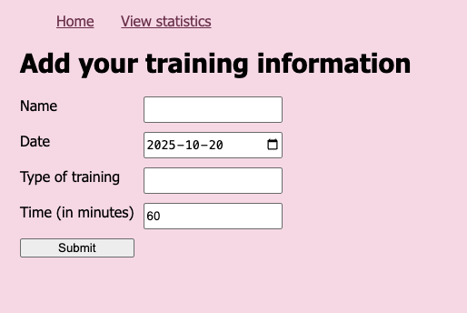
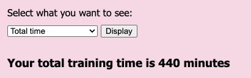
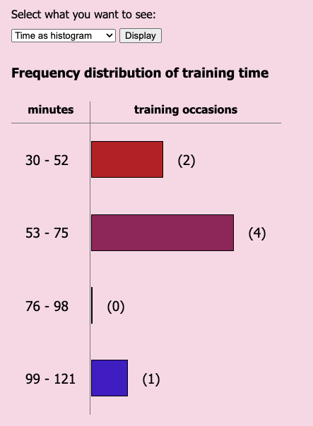

# Trainingstats 🚴🏀⚽🎾🏊🏃📈 
_Trainingstats_ is a simple training statistics application that lets you add information about your training and gather statistics about it.  

- You decide yourself for which types of training you want to use the application. 
- Add each training occassion individually.
- The time is set to 60 minutes by default, but you can change it if your session was shorter or longer.
- Select different statistic views to summarize your training from different angles. 

> **Scope**: This web application was developed as a 2-week school project for the course [1DV610](https://coursepress.lnu.se/kurs/introduktion-till-mjukvarukvalitet/).

## Add information about your training

## Get statistics about your training

### 🕙 Total training time
  

### 📊 Frequency distribution of training time

## Usage
Go to [https://trainingstats.mariamair.se](https://trainingstats.mariamair.se) to use the application.

## Bugs and issues
➡️ [List of open issues](https://github.com/mariamair/trainingstats/issues)

If you find any vulnerabilities, bugs or issues not reported in the list, please add them as an [issue](.readme/requestForChange.md).

## Technical information
The application was developed with and tested for Node version 24.1.0.

### Versions and releases
Version 1.0.0, released 2025-10-20.

### Test report
For detailed information about the tests, see the [test report](./test/reports/testreport.md).

## License
[MIT License](LICENSE)

## Contributing
Interested in contributing to this application? Please see the [contribution guidelines](CONTRIBUTING.md).